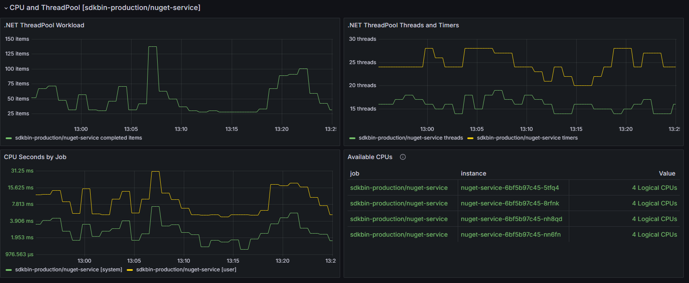

# .NET Grafana Dashboards 📊
[Grafana dashboards](https://grafana.com/) for popular .NET OpenTelemetry metrics

## Available Dashboards 🎯

### [.NET Runtime Dashboard](runtime/README.md) ⚡
Comprehensive monitoring of .NET runtime metrics including garbage collection, JIT compilation, thread pool performance, and exception tracking.

### [Kestrel Connections Dashboard](kestrel/README.md) 🚀
Monitor ASP.NET Core Kestrel web server performance metrics including connection durations, active connections, connection rates, and queue lengths.

## Features ✨

- 📈 Ready-to-use Grafana dashboards for .NET applications
- 📡 OpenTelemetry-based metrics collection
- 🔌 Prometheus and OTLP exporter support
- 📝 Detailed installation and configuration instructions
- 🔍 Comprehensive metric explanations and troubleshooting guides

## Getting Started 🚦

Each dashboard directory contains:
- 📖 A detailed README with setup instructions
- 🗃️ The dashboard JSON file for Grafana import
- 🖼️ Screenshots showing the dashboard in action
- 🛠️ Prerequisites and troubleshooting guides

## Credits 🙌

These dashboards are maintained by [Petabridge](https://petabridge.com/), experts in building high-performance .NET applications and distributed systems - mostly with [Akka.NET](https://getakka.net/). Visit [petabridge.com](https://petabridge.com/) to learn more about their professional services, training, and open-source contributions to the .NET ecosystem.
