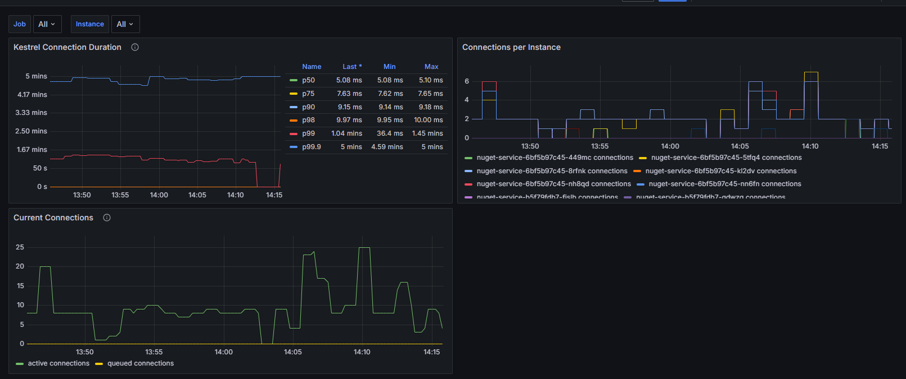

# Kestrel Connections Dashboard

This Grafana dashboard provides detailed monitoring and visualization of [ASP.NET Core Kestrel web server](https://learn.microsoft.com/en-us/aspnet/core/fundamentals/servers/kestrel) performance metrics. It focuses on connection-level metrics that are crucial for understanding your web application's performance and behavior at the server level.

## Dashboard Overview



The dashboard includes metrics for:
- Connection duration percentiles (p50, p75, p90, p98, p99)
- Active and queued connections
- Connections per instance of each application

## Prerequisites

To use this dashboard, you need to have the [`OpenTelemetry.Instrumentation.AspNetCore`](https://www.nuget.org/packages/OpenTelemetry.Instrumentation.AspNetCore) package installed in your .NET application:

```xml
<ItemGroup>
    <PackageReference Include="OpenTelemetry.Instrumentation.AspNetCore" Version="{version}" />
</ItemGroup>
```

This dashboard is designed to work with Prometheus and the OTLP Exporter. 

```csharp
var builder = WebApplication.CreateBuilder(args);

builder.Services.AddOpenTelemetry()
    .WithMetrics(metrics =>
    {
        metrics
            // OTHER METRICS SOURCES
            .AddAspNetCoreInstrumentation();
            
    })
    // traces, et al
    .UseOtlpExporter();

var app = builder.Build();
```

## Installation

1. Import the dashboard into Grafana from Grafana Cloud:

2. Import the dashboard into Grafana as a JSON file:
   - Open Grafana
   - Navigate to Dashboards > Import
   - Click "Upload JSON file"
   - Select the [`kestrel-connections-dashboard.json`](kestrel-connections-dashboard.json) file
   - Select your Prometheus data source
   - Click "Import"

## Metrics Explanation

- **Connection Duration**: Shows how long Kestrel connections stay open, broken down by percentiles
- **Active Connections**: Real-time count of current open connections
- **Connection Rate**: Number of new connections per second
- **Queue Length**: Number of connections waiting to be processed