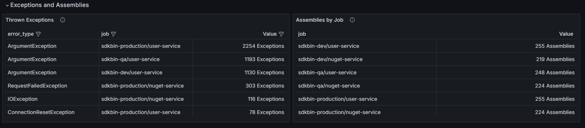
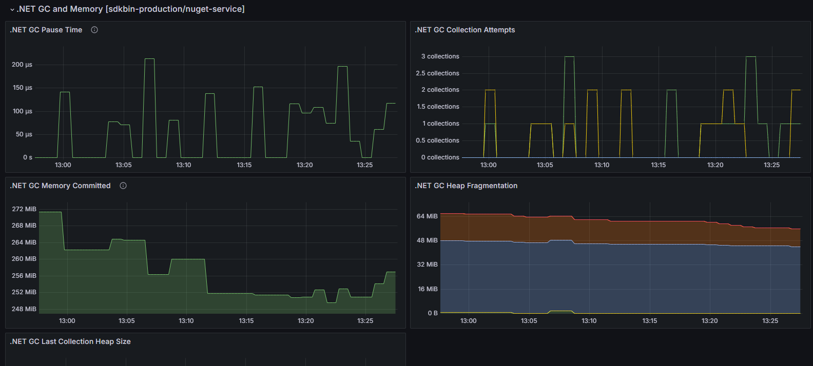
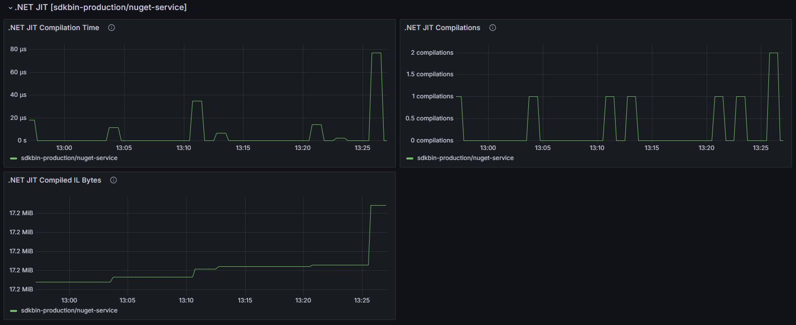

# .NET Runtime Dashboard

This Grafana dashboard provides comprehensive monitoring of .NET Core runtime metrics, giving you deep insights into your application's performance, memory management, threading, and exception handling.

## Dashboard Overview

The dashboard is divided into several key sections:

### Exceptions and Assembly Loading


### Garbage Collection Performance


### JIT Compilation Metrics


### ThreadPool and CPU Usage


## Features

- **Exception Monitoring**: Track both handled and unhandled exceptions
- **Garbage Collection**: Monitor GC performance, heap sizes, and collection frequencies
- **JIT Compilation**: Track JIT compilation times and methods
- **ThreadPool**: Monitor thread pool utilization and CPU usage
- **Assembly Loading**: Track loaded assemblies and loading times
- **Memory Usage**: Monitor detailed memory metrics across different generations

## Prerequisites

This dashboard supports **two different sources** of .NET runtime metrics:

### Option 1: .NET 9+ Built-in Metrics (Recommended for .NET 9+)

**.NET 9 and later** automatically emit runtime metrics via the `System.Runtime` meter - **no additional packages required**!

```csharp
var builder = WebApplication.CreateBuilder(args);

builder.Services.AddOpenTelemetry()
    .WithMetrics(metrics =>
    {
        metrics
            .AddMeter("System.Runtime")  // Automatically emits runtime metrics in .NET 9+
            // OTHER METRICS SOURCES
    })
    .UseOtlpExporter();

var app = builder.Build();
```

**Documentation**: [.NET Built-in Runtime Metrics](https://learn.microsoft.com/en-us/dotnet/core/diagnostics/built-in-metrics-runtime)

### Option 2: OpenTelemetry.Instrumentation.Runtime Package (For .NET 6/7/8)

For **.NET 6, 7, and 8**, install the [`OpenTelemetry.Instrumentation.Runtime`](https://www.nuget.org/packages/OpenTelemetry.Instrumentation.Runtime) package:

```xml
<ItemGroup>
    <PackageReference Include="OpenTelemetry.Instrumentation.Runtime" Version="1.9.0" />
</ItemGroup>
```

```csharp
var builder = WebApplication.CreateBuilder(args);

builder.Services.AddOpenTelemetry()
    .WithMetrics(metrics =>
    {
        metrics
            .AddRuntimeInstrumentation()  // For .NET 6/7/8
            // OTHER METRICS SOURCES
    })
    .UseOtlpExporter();

var app = builder.Build();
```

> **Note**: This dashboard works with both metric sources automatically using PromQL regex matching. Most metrics are available in both sources, but **CPU metrics are only available in .NET 9+ built-in metrics**.

This dashboard is designed to work with Prometheus via the OTLP Exporter.

## Installation

1. Import the dashboard into Grafana from Grafana Cloud: [https://grafana.com/grafana/dashboards/23179](https://grafana.com/grafana/dashboards/23179)

2. Import the dashboard into Grafana as a JSON file:
   - Open Grafana
   - Navigate to Dashboards > Import
   - Click "Upload JSON file"
   - Select the [`dotnet-runtime-dashboard.json`](dotnet-runtime-dashboard.json) file
   - Select your Prometheus data source
   - Click "Import"

## Metrics Explanation

### Exception Metrics
- Total exceptions thrown
- Exception types and frequencies
- Exception rate over time

### GC Metrics
- GC collection counts by generation
- GC pause times
- Heap sizes
- Memory allocation rates

### JIT Metrics
- Methods JIT compiled
- JIT compilation times
- Assembly loading metrics

### ThreadPool Metrics
- Thread pool queue length
- Thread count
- Thread pool completion rate
- CPU usage per thread

## Compatibility

### Metric Sources

This dashboard automatically supports both:
- **.NET 9+ built-in metrics** using `dotnet.*` naming convention
- **OpenTelemetry.Instrumentation.Runtime** using `process.runtime.dotnet.*` naming convention

The dashboard uses PromQL regex patterns to query both metric naming conventions simultaneously, so it works regardless of which source you're using.

### Metric Availability

| Metric Category | .NET 9+ Built-in | OpenTelemetry.Instrumentation.Runtime |
|----------------|------------------|---------------------------------------|
| Exceptions | ✅ | ✅ |
| Assemblies | ✅ | ✅ |
| Garbage Collection | ✅ | ✅ |
| ThreadPool | ✅ | ✅ |
| Timers | ✅ | ✅ |
| JIT Compilation | ✅ | ✅ |
| **CPU Metrics** | ✅ | ❌ Not available |

> **Note**: CPU time and CPU count panels will only show data for applications using .NET 9+ built-in metrics. These metrics are not available in the OpenTelemetry.Instrumentation.Runtime package for .NET 6/7/8.

### .NET Version Support

- **.NET 9+**: Use built-in `System.Runtime` meter (no additional packages)
- **.NET 8**: Use OpenTelemetry.Instrumentation.Runtime package
- **.NET 7**: Use OpenTelemetry.Instrumentation.Runtime package
- **.NET 6**: Use OpenTelemetry.Instrumentation.Runtime package

### Migration from .NET 8 to .NET 9

When migrating from .NET 8 to .NET 9:
1. You can remove the `AddRuntimeInstrumentation()` call and switch to `AddMeter("System.Runtime")`
2. Or keep using `AddRuntimeInstrumentation()` - newer versions automatically detect .NET 9 and use built-in metrics
3. The dashboard will work correctly with either approach