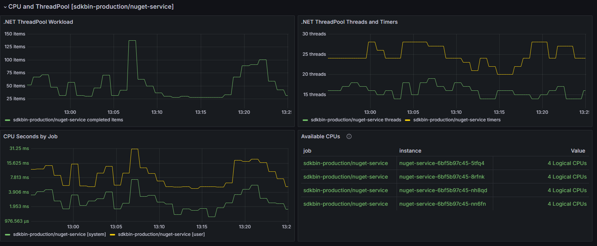

# .NET Runtime Dashboard

This Grafana dashboard provides comprehensive monitoring of .NET Core runtime metrics, giving you deep insights into your application's performance, memory management, threading, and exception handling.

## Dashboard Overview

The dashboard is divided into several key sections:

### Exceptions and Assembly Loading


### Garbage Collection Performance


### JIT Compilation Metrics


### ThreadPool and CPU Usage


## Features

- **Exception Monitoring**: Track both handled and unhandled exceptions
- **Garbage Collection**: Monitor GC performance, heap sizes, and collection frequencies
- **JIT Compilation**: Track JIT compilation times and methods
- **ThreadPool**: Monitor thread pool utilization and CPU usage
- **Assembly Loading**: Track loaded assemblies and loading times
- **Memory Usage**: Monitor detailed memory metrics across different generations

## Prerequisites

To use this dashboard, you need to have the following [`OpenTelemetry.Instrumentation.Runtime`](https://www.nuget.org/packages/OpenTelemetry.Instrumentation.Runtime) package installed in your .NET application:

```xml
<ItemGroup>
    <PackageReference Include="OpenTelemetry.Instrumentation.Runtime" Version="{version}" />
</ItemGroup>
```

This dashboard is designed to work with Prometheus and the OTLP Exporter. 

```csharp
var builder = WebApplication.CreateBuilder(args);

builder.Services.AddOpenTelemetry()
    .WithMetrics(metrics =>
    {
        metrics
            // OTHER METRICS SOURCES
            .AddRuntimeInstrumentation();
            
    })
    // traces, et al
    .UseOtlpExporter();

var app = builder.Build();
```

## Installation

1. Import the dashboard into Grafana from Grafana Cloud:

2. Import the dashboard into Grafana as a JSON file:
   - Open Grafana
   - Navigate to Dashboards > Import
   - Click "Upload JSON file"
   - Select the [`dotnet-runtime-dashboard.json`](dotnet-runtime-dashboard.json) file
   - Select your Prometheus data source
   - Click "Import"

## Metrics Explanation

### Exception Metrics
- Total exceptions thrown
- Exception types and frequencies
- Exception rate over time

### GC Metrics
- GC collection counts by generation
- GC pause times
- Heap sizes
- Memory allocation rates

### JIT Metrics
- Methods JIT compiled
- JIT compilation times
- Assembly loading metrics

### ThreadPool Metrics
- Thread pool queue length
- Thread count
- Thread pool completion rate
- CPU usage per thread

## Troubleshooting

If you're not seeing metrics:
1. Verify that your application is exposing metrics at `/metrics` endpoint
2. Check that Prometheus is correctly scraping your application
3. Ensure all required OpenTelemetry packages are installed and properly configured
4. Verify that the Runtime instrumentation is properly initialized
5. Check that your application has sufficient permissions to collect runtime metrics

## Additional Notes

- The dashboard automatically adjusts time ranges and refresh rates
- All metrics are collected with minimal performance impact
- Metrics are available for both debug and release builds
- The dashboard works with both self-hosted and cloud-hosted applications 